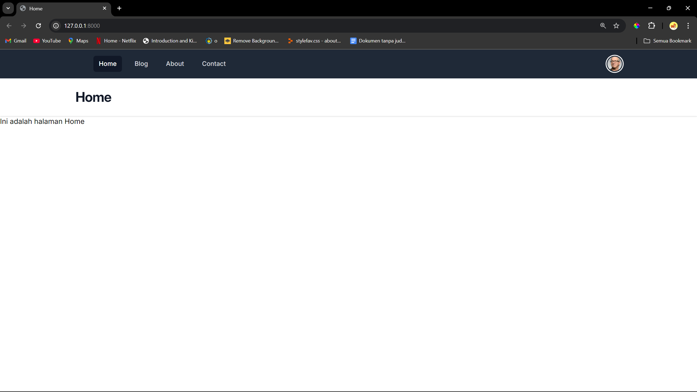
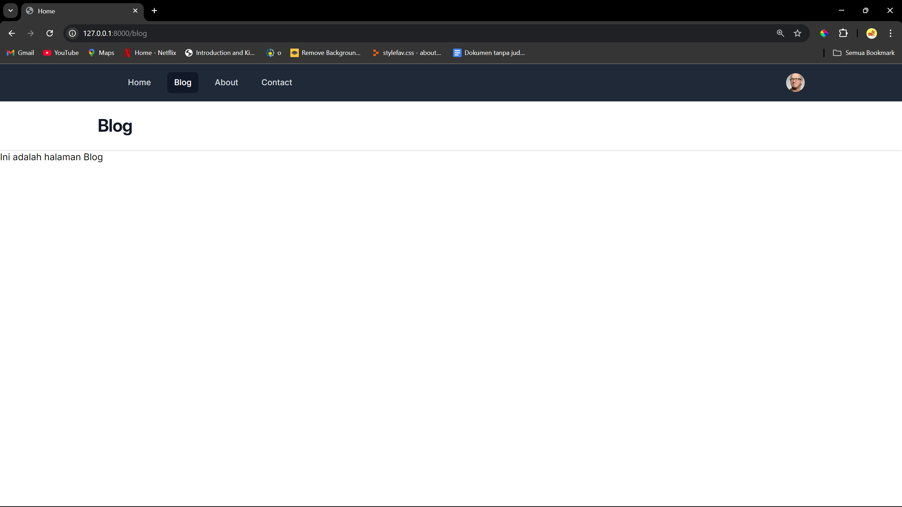
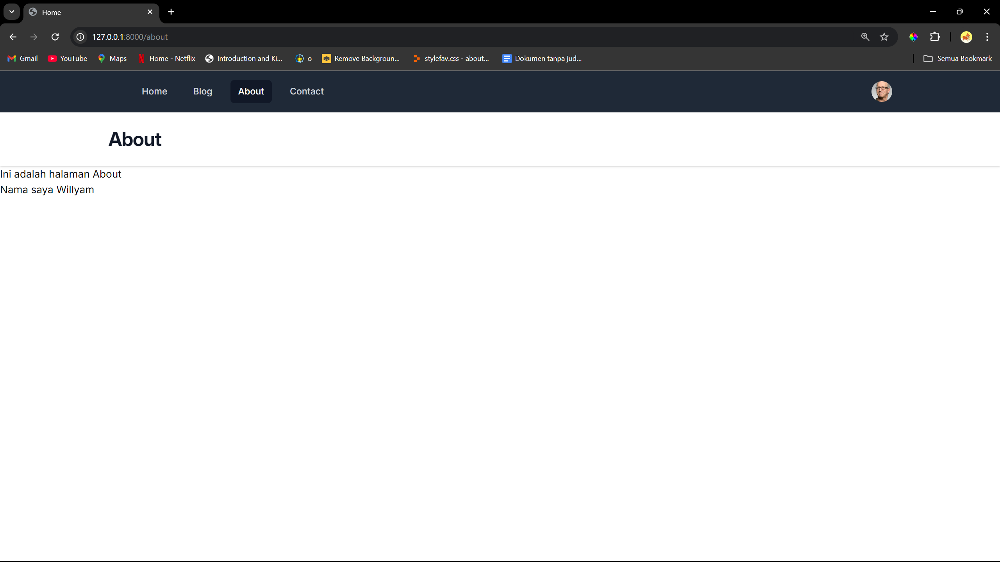
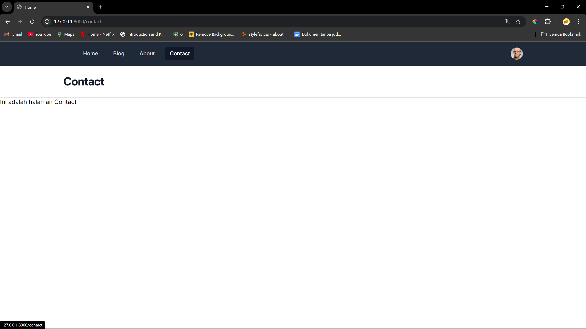

# Tugas-1 PBKK D

<div style="text-align:justify;">
Pada tugas pertemuan pertama ini, kita diminta untuk mengikuti tutorial yang telah diberikan pada classroom. Tutorial tersebut memberikan materi berupa blade pada Laravel 11. Berikut tampilan yang didapatkan setelah mengikuti tutorial yang diberikan:
</div>

<br>

<div>

1. Tampilan Home-Page
   

2. Tampilan Blog-Page
   

3. Tampilan About Page
   

4. Tampilan Contact Page

</div>

<div style="text-align:justify;">
Untuk mendapatkan hasil seperti diatas tentu saja kita membutuhkan 4 file blade yaitu

- [home.blade.php](laravel11/resources/views/home.blade.php)
- [blog.blade.php](laravel11/resources/views/blog.blade.php)
- [about.blade.php](laravel11/resources/views/about.blade.php)
- [contact.blade.php](laravel11/resources/views/contact.blade.php)

Kita juga harus membuat route untuk merepresentasikan url dari masing - masing file blade tersebut.

```php
<?php

use Illuminate\Support\Facades\Route;

Route::get('/', function () {
    return view('home',['title' => 'Home']);
});

Route::get('/blog', function () {
    return view('blog',['title' => 'Blog']);
});
Route::get('/about', function () {
    return view('about',['title' => 'About'],['name'=>'Willyam']);
});
Route::get('/contact', function () {
    return view('contact',['title' => 'Contact']);
});
```

Kode tersebut memiliki arti jika kita mengakses **/(atau halaman utama)** maka kita akan diberikan tampilan dari file [home.blade.php](laravel11/resources/views/home.blade.php) begitu juga seterusnya.

Karena tampilan dari masing - masing page kita memiliki template navbar dan header yang sama, sehingga untuk menghindari duplikasi kode kita dapat memanfaatkan blade-component. Kita dapat membuat template navbar dan header menjadi sebuah file berbeda pada folder component menggunakan perintah

```bash
php artisan make:component Navbar
php artisan make:component Header --view
```

Setelah file Navbar dan Header telah berhasil dibuat, maka kita membuat potongan kode Navbar dan Header kita pada file tersebut. Berikut adalah template dari Navbar dan Header yang kita miliki:

- [navbar.blade.php](laravel11/resources/views/components/navbar.blade.php)
- [header.blade.php](laravel11/resources/views/components/header.blade.php)

Pada template navbar kita terdapat beberapa potongan kode yang seharusnya kita buat secara dinamis, seperti class active yang akan berganti - ganti sesuai dengan halaman yang saat ini sedang kita akses. Sehingga kita menggunakan potongan kode seperti berikut:

```php
:active="request()->is('/')
:active="request()->is('/blog')
:active="request()->is('/about')
:active="request()->is('/contact')
```

Potongan kode tersebut memiliki arti, bahwa hanya ketika mengakses halaman tersebut maka halaman tersebut akan memiliki class active.

Begitu juga untuk Header pada web kita juga memiliki template yang sama namun terdapat beberapa potongan kode yang harus kita buat secara dinamis, yaitu tulisan Home, Blog, About,Contact pada halaman atas kita.

Hal tersebut dilakukan dengan mempassing sebuah variabel (bernama title) yang dipasing melalui route pada [web.php](laravel11/routes/web.php).

```php
['title' => 'Home']
['title' => 'Blog']
['title' => 'About']
['title' => 'Contact']
```

Namun, variabel tersebut hanya bisa diakses oleh 4 file blade utama kita. Sehingga pada masing - masing file tersebut kita akan mempasing variabel tersebut dengan kode sebagai berikut:

```php
    <x-slot:title>
        {{ $title }}
    </x-slot:title>
```

Variabel tersebut akan diteruskan pada file [layout.blade.php](laravel11/resources/views/components/layout.blade.php) yang akan diberikan pada file header kita dan dipanggil sebagai slot.

Berikut adalah potongan kode pada [layout.blade.php](laravel11/resources/views/components/layout.blade.php):

```php
<x-header> {{ $title }} </x-header>
```

Berikut adalah kode pada [header.blade.php](laravel11/resources/views/components/header.blade.php):

```html
<header class="bg-white shadow">
  <div class="mx-auto max-w-7xl px-4 py-6 sm:px-6 lg:px-8">
    <h1 class="text-3xl font-bold tracking-tight text-gray-900">{{ $slot }}</h1>
  </div>
</header>
```

Component terakhir yang kita miliki adalah [layout.blade.php](laravel11/resources/views/components/layout.blade.php) yang merupakan template utama kita sehingga pada 4 file utama kita tidak perlu menduplikasikan kode yang sama secara berulang karena sudah menggunakan component layout yang telah kita buat.

```html
<!DOCTYPE html>
<html lang="en" class="h-full bg-gray-100>
<head>
    <meta charset="UTF-8">
<meta name="viewport" content="width=device-width, initial-scale=1.0">
<meta http-equiv="X-UA-Compatible" content="ie=edge">
<link rel="stylesheet" href="https://rsms.me/inter/inter.css">
@vite('resources/css/app.css')
<script defer src="https://cdn.jsdelivr.net/npm/alpinejs@3.x.x/dist/cdn.min.js"></script>
<title>Home</title>
</head>

<body class="h-full">
    <div class="min-h-full">
        <x-navbar></x-navbar>
        <x-header> {{ $title }} </x-header>
        <main>
            {{ $slot }}
        </main>
    </div>
</body>

</html>

```

- `<x-navbar>` berfungsi untuk memanggil template navbar pada layout kita
- `<x-header>` berfungsi untuk memanggil template header pada layout kita yang akan mempasing nilai variabel title dari route yang telah diberikan seperti sudah dijelaskan sebelumnya.
- `slot` yang akan menyimpan perubahan yang terdapat pada masing masing file blade kita secara dinamis. Pada kasus kita maka nilai slot tersebut berupa **Ini adalah halaman Home**,**Ini adalah halaman Blog**,dan seterusnya.

</div>

# Tugas-2 PBKK D