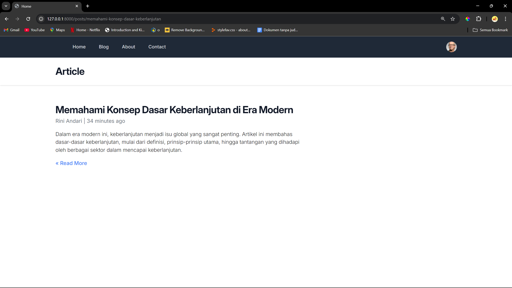

# Tugas-1 PBKK D

<div style="text-align:justify;">
Pada tugas pertemuan pertama ini, kita diminta untuk mengikuti tutorial yang telah diberikan pada classroom. Tutorial tersebut memberikan materi berupa blade pada Laravel 11. Berikut tampilan yang didapatkan setelah mengikuti tutorial yang diberikan:
</div>

<br>

<div>

1. Tampilan Home-Page
   

2. Tampilan Blog-Page
   

3. Tampilan About Page
   

4. Tampilan Contact Page

</div>

<div style="text-align:justify;">
Untuk mendapatkan hasil seperti diatas tentu saja kita membutuhkan 4 file blade yaitu

- [home.blade.php](laravel11/resources/views/home.blade.php)
- [blog.blade.php](laravel11/resources/views/blog.blade.php)
- [about.blade.php](laravel11/resources/views/about.blade.php)
- [contact.blade.php](laravel11/resources/views/contact.blade.php)

Kita juga harus membuat route untuk merepresentasikan url dari masing - masing file blade tersebut.

```php
<?php

use Illuminate\Support\Facades\Route;

Route::get('/', function () {
    return view('home',['title' => 'Home']);
});

Route::get('/blog', function () {
    return view('blog',['title' => 'Blog']);
});
Route::get('/about', function () {
    return view('about',['title' => 'About'],['name'=>'Willyam']);
});
Route::get('/contact', function () {
    return view('contact',['title' => 'Contact']);
});
```

Kode tersebut memiliki arti jika kita mengakses **/(atau halaman utama)** maka kita akan diberikan tampilan dari file [home.blade.php](laravel11/resources/views/home.blade.php) begitu juga seterusnya.

Karena tampilan dari masing - masing page kita memiliki template navbar dan header yang sama, sehingga untuk menghindari duplikasi kode kita dapat memanfaatkan blade-component. Kita dapat membuat template navbar dan header menjadi sebuah file berbeda pada folder component menggunakan perintah

```bash
php artisan make:component Navbar
php artisan make:component Header --view
```

Setelah file Navbar dan Header telah berhasil dibuat, maka kita membuat potongan kode Navbar dan Header kita pada file tersebut. Berikut adalah template dari Navbar dan Header yang kita miliki:

- [navbar.blade.php](laravel11/resources/views/components/navbar.blade.php)
- [header.blade.php](laravel11/resources/views/components/header.blade.php)

Pada template navbar kita terdapat beberapa potongan kode yang seharusnya kita buat secara dinamis, seperti class active yang akan berganti - ganti sesuai dengan halaman yang saat ini sedang kita akses. Sehingga kita menggunakan potongan kode seperti berikut:

```php
:active="request()->is('/')
:active="request()->is('/blog')
:active="request()->is('/about')
:active="request()->is('/contact')
```

Potongan kode tersebut memiliki arti, bahwa hanya ketika mengakses halaman tersebut maka halaman tersebut akan memiliki class active.

Begitu juga untuk Header pada web kita juga memiliki template yang sama namun terdapat beberapa potongan kode yang harus kita buat secara dinamis, yaitu tulisan Home, Blog, About,Contact pada halaman atas kita.

Hal tersebut dilakukan dengan mempassing sebuah variabel (bernama title) yang dipasing melalui route pada [web.php](laravel11/routes/web.php).

```php
['title' => 'Home']
['title' => 'Blog']
['title' => 'About']
['title' => 'Contact']
```

Namun, variabel tersebut hanya bisa diakses oleh 4 file blade utama kita. Sehingga pada masing - masing file tersebut kita akan mempasing variabel tersebut dengan kode sebagai berikut:

```php
    <x-slot:title>
        {{ $title }}
    </x-slot:title>
```

Variabel tersebut akan diteruskan pada file [layout.blade.php](laravel11/resources/views/components/layout.blade.php) yang akan diberikan pada file header kita dan dipanggil sebagai slot.

Berikut adalah potongan kode pada [layout.blade.php](laravel11/resources/views/components/layout.blade.php):

```php
<x-header> {{ $title }} </x-header>
```

Berikut adalah kode pada [header.blade.php](laravel11/resources/views/components/header.blade.php):

```html
<header class="bg-white shadow">
  <div class="mx-auto max-w-7xl px-4 py-6 sm:px-6 lg:px-8">
    <h1 class="text-3xl font-bold tracking-tight text-gray-900">{{ $slot }}</h1>
  </div>
</header>
```

Component terakhir yang kita miliki adalah [layout.blade.php](laravel11/resources/views/components/layout.blade.php) yang merupakan template utama kita sehingga pada 4 file utama kita tidak perlu menduplikasikan kode yang sama secara berulang karena sudah menggunakan component layout yang telah kita buat.

```html
<!DOCTYPE html>
<html lang="en" class="h-full bg-gray-100>
<head>
    <meta charset="UTF-8">
<meta name="viewport" content="width=device-width, initial-scale=1.0">
<meta http-equiv="X-UA-Compatible" content="ie=edge">
<link rel="stylesheet" href="https://rsms.me/inter/inter.css">
@vite('resources/css/app.css')
<script defer src="https://cdn.jsdelivr.net/npm/alpinejs@3.x.x/dist/cdn.min.js"></script>
<title>Home</title>
</head>

<body class="h-full">
    <div class="min-h-full">
        <x-navbar></x-navbar>
        <x-header> {{ $title }} </x-header>
        <main>
            {{ $slot }}
        </main>
    </div>
</body>

</html>

```

- `<x-navbar>` berfungsi untuk memanggil template navbar pada layout kita
- `<x-header>` berfungsi untuk memanggil template header pada layout kita yang akan mempasing nilai variabel title dari route yang telah diberikan seperti sudah dijelaskan sebelumnya.
- `slot` yang akan menyimpan perubahan yang terdapat pada masing masing file blade kita secara dinamis. Pada kasus kita maka nilai slot tersebut berupa **Ini adalah halaman Home**,**Ini adalah halaman Blog**,dan seterusnya.

</div>

# Tugas-2 PBKK D

<div style="text-align:justify;">
Pada tugas pertemuan kedua ini, kita diminta untuk membuat sebuah model yang akan mengirimkan data untuk kita tampilkan pada view post(article-page). Data yang kita miliki disimpan dalam sebuah model sehingga efektif karena tidak ada duplikasi penulisan kode.
</div>

<br>

<div>

1. Tampilan Blog-Page (Update)
   

2. Tampilan Article-Page
   

   
   </div>

<div style="text-align:justify;">
Langkah pertama yang perlu kita lakukan yaitu membuat sebuah model, yang akan menyimpan data artikel yang akan kita tampilkan. Kita perlu membuat sebuah class bernama Post yang akan menjadi model kita.
</div>

```php

<?php

namespace App\Models;

use Illuminate\Support\Arr;

class Post
{
    public static function all()
    {
        return [
            [
                'id' => 1,
                'slug' => 'judul-artikel-1',
                'title' => 'Judul Artikel 1',
                'author' => 'Sandhika Galih',
                'body' => 'Lorem ipsum dolor sit, amet consectetur adipisicing elit. Velit, fugit dignissimos
                accusantium corrupti dicta
                voluptatem consectetur sed aliquam in ratione, neque modi voluptatum pariatur quis? Ad maiores neque tempora
                impedit.'
            ],
            [
                'id' => 2,
                'slug' => 'judul-artikel-2',
                'title' => 'Judul Artikel 2',
                'author' => 'Sandhika Galih',
                'body' => 'Lorem ipsum dolor sit amet consectetur adipisicing elit. Natus ab amet distinctio
                iusto facere ullam doloremque corporis nihil et quia odio modi, maiores eius. Commodi enim laudantium
                voluptates cumque eum.'
            ]
        ];
    }

    public static function find($slug):array
    {
        $post= Arr::first(static::all(), fn($post) => $post['slug'] == $slug);

        if(!$post){
            abort(404);
        }
        return $post;
    }
}

?>

```

<div style="text-align:justify;">

Pada class Post ini terdapat 2 fungsi yaitu fungsi **all()** dan fungsi **find()**. Berikut penjelasan dari masing - masing fungsi tersebut:

- `Fungsi all()`: berfungsi untuk menyimpan semua data artikel yang kita miliki.

- `Fungsi find()`: berfungsi untuk mengembalikan artikel sesuai dengan nilai slug yang diberikan.

**Slug** disini berfungsi sebagai identitas pengenal dari masing - masing artikel yang unique. Slug juga akan menjadi url dari masing - masing artikel yang kita miliki sebagai contoh dalam kasus artikel 1 maka url dari artikel tersebut yaitu `posts/judul-artikel-1`

Agar class Post kita dapat diakses oleh route yang kita miliki maka kita perlu menambahkan namespace. Sehingga pada route kita dapat menambahkan `use App\Models\Post;` agar dapat mengakses class Post yang telah kita buat pada model.

Pada fungsi find kita juga dapat menambahkan logika percabangan untuk mengatasi url yang tidak sesuai. Kita menggunakan fungsi abort yang telah disediakan oleh laravel sehingga ketika url yang diberikan tidak sesuai maka akan mengembalikan tampilan **page not found**


</div>

<div style="text-align:justify;">

Kita juga perlu menambahkan sebuah variabel pada route posts (sebelumnya merupakan route blog) untuk menyimpan semua artikel yang kita miliki dalam model. Kita menggunakan fungsi **all()** untuk mengembalikan semua artikel lalu menyimpannya ke dalam variabel posts.

```php

Route::get('/posts', function () {
    return view('posts', ['title' => 'Blog', 'posts' => Post::all()]);
});

```

Kemudian kita menampilkannya ke dalam view posts menggunakan **@foreach** lalu memasukan nilai dari array post yang kita miliki. Penggunaan foreach digunakan agar tidak terdapat duplikasi dalam penulisan kode.

```html
<x-layout>
  <x-slot:title> {{ $title }} </x-slot:title>
  @foreach ($posts as $post)
  <article class="py-8 max-w-screen-md border-b border-gray-300">
    <a href="/posts/{{ $post['slug'] }}" class="hover:underline">
      <h2 class="font-bold mb-1 text-3xl tracking-tight text-gray-900">
        {{ $post['title'] }}
      </h2>
    </a>
    <div class="text-base text-gray-500 hover:underline">
      <a href="#"> {{ $post['author'] }} | 1 January 2024 </a>
    </div>
    <p class="my-4 font-light">{{ Str::limit($post['body'], 150) }}</p>
    <a
      href="/posts/{{ $post['slug'] }}"
      class="font-medium text-blue-500 hover:underline"
      >Read More &raquo;</a
    >
  </article>
  @endforeach
</x-layout>
```

Kemudian untuk navigasi dari masing - masing artikel, kita akan mempassing nilai dari masing - masing slug yang dimiliki oleh artikel sebagai contoh `posts/judul-artikel-1`. Namun, kita sebelumnya kita perlu menambahkan route yang akan menyimpan nilai slug yang telah dipassing sebelumnya.

</div>

```php

Route::get('/posts/{slug}', function ($slug) {
    $post = Post::find($slug);


    return view('post',['title' => 'Article','post' => $post]);
});

```

<div style="text-align:justify;">

Dalam kode tersebut terlihat bahwa semua url yang tertulis setelah **/posts** akan disimpan ke dalam slug. Lalu kita memanfaatkan slug tersebut untuk digunakan ke dalam fungsi **find()** di dalam class Post yang telah kita buat. Setelah kita mendapatkan nilai dari fungsi **find()** kita akan memanggil sebuah view yang akan menampilkan artikel sesuai slug yang telah diberikan. Berikut adalah potongan kode dari view post:

```html
<x-layout>
  <x-slot:title> {{ $title }} </x-slot:title>
  <article class="py-8 max-w-screen-md">
    <h2 class="font-bold mb-1 text-3xl tracking-tight text-gray-900">
      {{ $post['title'] }}
    </h2>
    <div class="text-base text-gray-500 hover:underline">
      <a href="#"> {{ $post['author'] }} | 1 January 2024 </a>
    </div>
    <p class="my-4 font-light">{{ $post['body'] }}</p>
    <a href="/posts" class="font-medium text-blue-500 hover:underline"
      >&laquo; Read More</a
    >
  </article>
</x-layout>
```

View post ini akan menampilkan artikel sesuai dengan nilai slug yang telah dipassing pada route.

</div>

# Tugas-3 PBKK D

<div style="text-align:justify;">
Pada tugas pertemuan ketiga ini, kita diminta untuk menampilkan artikel yang telah kita buat dipertemuan sebelumnya menggunakan database. Berikut adalah tampilan dari page yang telah dibuat:
</div>

<br>

<div>

1. Tampilan Blog-Page (Menggunakan Database)

   

2. Tampilan Article-Page (Menggunakan Database)

   

   </div>

<div style="text-align:justify;">

Tidak ada perubahan yang signifakan pada tampilan UI dari page tersebut. Namun perbedaannya adalah saat ini kita menggunakan database untuk menyimpan data dari artikel yang kita miliki. Agar kita dapat menghubungkannya ke database kita langkah pertama yang harus kita lakukan adalah mengubah config dari laravel yang kita miliki.

</div>


<div style="text-align:justify;">

Karena disini saya menggunakan sqlite jadi disini `DB_CONNECTION` harus diatur menjadi sqlite sehingga sqlite yang kita gunakan sudah terhubung dengan web yang kita buat.

</div>

<div style="text-align:justify;">

Kemudian kita harus membaut sebuah model yang terhubung langsung dengan migration yang akan kita buat. Untuk membuat demikian kita dapat memanfaatkan php artisan untuk membuat model yang terhubung langsung dengan migrationnya. Kita dapat melakukannya dengan menjalankan command:

</div>

```bash

php artisan make:Model Post -m

```

<div style="text-align:justify;">

Lalu kita perlu melakukan modifikasi sedikit pada model Post kita dimana sebelumnya kita menggunakan fungsi all() dan fungsi find() yang mana kita tidak membutuhkan fungsi itu lagi karena fungsi tersebut sudah disediakan langsung oleh class Model yang akan kita extend pada class Post kita.

```php

<?php

namespace App\Models;

use Illuminate\Database\Eloquent\Factories\HasFactory;
use Illuminate\Database\Eloquent\Model;

class Post extends Model
{
    use HasFactory;
    protected $fillable=['slug','title','author','body'];
}


```

Potongan kode `protected $fillable` disini berfungsi untuk menandai field mana yang dapat kita isi (dalam kasus ini saya menggunakan php artisan tinker) sehingga field lainnya seperti id,created_at, dan updated_at akan diisi secara otomatis.

Lalu untuk route yang kita gunakan untuk menampilkan masing - masing artikel dimana sebelumnya kita menggunakan fungsi find() juga sudah disediakan oleh class Model tersebut sehingga penulisan pada route kita modifikasi menjadi seperti ini

</div>

```php

Route::get('/posts/{post:slug}', function (Post $post) {
    return view('post',['title' => 'Article','post' => $post]);
});

```

<div style="text-align:justify;">

Dalam kode tersebut kita dapat langsung mengambil `post:slug` sehingga kita tidak memerlukan fungsi find lagi.

Untuk melakukan insert data ke dalam database saya menggunakan php artisan tinker. Kemudian kita dapat menjalankan command sebagai berikut:

```php

App\Models\Post::create([
  'title' => 'Menghadapi Tantangan Dunia Kerja di Era Digital',
  'author' => 'Rizky Pratama',
  'slug' => 'menghadapi-tantangan-dunia-kerja-era-digital',
  'body' => 'Era digital membawa perubahan signifikan dalam dunia kerja. Artikel ini membahas tantangan utama yang dihadapi pekerja dan perusahaan di era digital, serta strategi untuk tetap relevan dan kompetitif dalam menghadapi perkembangan teknologi.'

]);

```

Jika telah berhasil, maka akan muncul tampilan sebagai berikut:


Data akan otomatis masuk ke dalam database kita.


Dan web kita akan secara otomatis menampilkan artikel yang kita masukan ke dalam database


Lalu untuk waktu postingan dari artikel kita, kita dapat memanfaatkan field `created_at` sehingga potongan kode dari view post kita menjadi sebagai berikut:

```html
<a href="#">
  {{ $post['author'] }} | {{ $post->created_at->diffForHumans() }}
</a>
```

</div>

# Tugas-4 PBKK D

<div style="text-align:justify;">

Pada tugas pertemuan kali ini, kita diminta untuk membuat sebuah _data dummy_ untuk ditampilkan pada page blog. Kita juga mempelajari tentang eloquent relationship yang akan diterapkan pada database yang kita miliki. Relasi yang kita miliki yaitu berupa **One-to-Many** pada tabel `Posts-User` dan `Posts-Category`.

</div>

<br>

<div>

1. Tampilan Blog-Page

   

2. Tampilan Author-Page

   

3. Tampilan Category-Page

   

</div>

<div style="text-align:justify;">

Tidak terdapat perubahan pada halaman blog, hanya saya sebelumnya kita melakukan input ke dalam database dengan cara manual, kali ini kita menggunakan factory yang akan membuat data dummy langsung untuk kita. Kita juga menambahkan halaman author yang akan menampilkan artikel apa saja yang dimiliki oleh author tertentu. Kita juga menambahkan halaman category yang akan menambahkan artikel apa saja yang masuk dalam kategori tertentu. Untuk melakukan itu, langkah yang pertama perlu kita lakukan adalah mengubah migration yang kita miliki.

</div>

```php

<?php

use Illuminate\Database\Migrations\Migration;
use Illuminate\Database\Schema\Blueprint;
use Illuminate\Support\Facades\Schema;

return new class extends Migration
{
    /**
     * Run the migrations.
     */
    public function up(): void
    {
        Schema::create('posts', function (Blueprint $table) {
            $table->id();
            $table->string('slug')->unique();
            $table->string('title');
            $table->foreignId('author_id')->constrained(
                table: 'users', indexName: 'posts_author_id'
            );
            $table->foreignId('category_id')->constrained(
                table: 'categories', indexName: 'posts_category_id'
            );
            $table->text('body');
            $table->timestamps();
        });
    }

    /**
     * Reverse the migrations.
     */
    public function down(): void
    {
        Schema::dropIfExists('posts');
    }
};

```

<div style="text-align:justify;">

Kita perlu menambahkan kolom baru untuk menyimpan author_id dan category_id sebagai foreign key yang akan kita gunakan untuk menampilkan artikel apa saja yang dimiliki oleh user tertentu atau kategori tertentu. Kemudian pada tabel user kita menambahkan username yang akan kita manfaatkan sebagai route kita.

</div>

```php

<?php

use Illuminate\Database\Migrations\Migration;
use Illuminate\Database\Schema\Blueprint;
use Illuminate\Support\Facades\Schema;

return new class extends Migration
{
    /**
     * Run the migrations.
     */
    public function up(): void
    {
        Schema::create('users', function (Blueprint $table) {
            $table->id();
            $table->string('name');
            $table->string('username')->unique();
            $table->string('email')->unique();
            $table->timestamp('email_verified_at')->nullable();
            $table->string('password');
            $table->rememberToken();
            $table->timestamps();
        });

        Schema::create('password_reset_tokens', function (Blueprint $table) {
            $table->string('email')->primary();
            $table->string('token');
            $table->timestamp('created_at')->nullable();
        });

        Schema::create('sessions', function (Blueprint $table) {
            $table->string('id')->primary();
            $table->foreignId('user_id')->nullable()->index();
            $table->string('ip_address', 45)->nullable();
            $table->text('user_agent')->nullable();
            $table->longText('payload');
            $table->integer('last_activity')->index();
        });
    }

    /**
     * Reverse the migrations.
     */
    public function down(): void
    {
        Schema::dropIfExists('users');
        Schema::dropIfExists('password_reset_tokens');
        Schema::dropIfExists('sessions');
    }
};

```

<div style="text-align:justify;">

Dan yang terakhir kita perlu menambahkan tabel category seperti berikut:

</div>

```php

<?php

use Illuminate\Database\Migrations\Migration;
use Illuminate\Database\Schema\Blueprint;
use Illuminate\Support\Facades\Schema;

return new class extends Migration
{
    /**
     * Run the migrations.
     */
    public function up(): void
    {
        Schema::create('categories', function (Blueprint $table) {
            $table->id();
            $table->string('slug')->unique();
            $table->string('name_category');
            $table->timestamps();
        });
    }

    /**
     * Reverse the migrations.
     */
    public function down(): void
    {
        Schema::dropIfExists('categories');
    }
};

```

<div style="text-align:justify;">

Setelah itu kita perlu membuat relasi antar model sesuai dengan design database yang kita inginkan. **Model Post** kita akan memiliki `BelongsTo` terhadap **model user** dan **model category**, sedangkan **model user** dan **model category** memiliki `HasMany` terhadap **model post**. Berikut potongan kode pada **Model Post,User, dan Category**

</div>

```php

<?php
// Model Post
namespace App\Models;

use Illuminate\Database\Eloquent\Model;
use Illuminate\Database\Eloquent\Relations\BelongsTo;
use Illuminate\Database\Eloquent\Factories\HasFactory;

class Post extends Model
{
    use HasFactory;
    protected $fillable=['slug','title','author_id','body','category_id'];

    public function author():BelongsTo{
        return $this->belongsTo(User::class);
    }
    public function category():BelongsTo{
        return $this->belongsTo(Category::class);
    }
}

```

```php

<?php
// Model User
namespace App\Models;

// use Illuminate\Contracts\Auth\MustVerifyEmail;
use App\Models\Post;
use Illuminate\Notifications\Notifiable;
use Illuminate\Database\Eloquent\Relations\HasMany;
use Illuminate\Database\Eloquent\Factories\HasFactory;
use Illuminate\Foundation\Auth\User as Authenticatable;

class User extends Authenticatable
{
    use HasFactory, Notifiable;

    /**
     * The attributes that are mass assignable.
     *
     * @var array<int, string>
     */
    protected $fillable = [
        'name',
        'email',
        'password',
    ];

    /**
     * The attributes that should be hidden for serialization.
     *
     * @var array<int, string>
     */
    protected $hidden = [
        'password',
        'remember_token',
    ];

    /**
     * Get the attributes that should be cast.
     *
     * @return array<string, string>
     */
    protected function casts(): array
    {
        return [
            'email_verified_at' => 'datetime',
            'password' => 'hashed',
        ];
    }
    public function posts(): HasMany
    {
        return $this->hasMany(Post::class,'author_id');
    }
}

```

```php

<?php
// Model Category
namespace App\Models;

use Illuminate\Database\Eloquent\Factories\HasFactory;
use Illuminate\Database\Eloquent\Model;
use Illuminate\Database\Eloquent\Relations\HasMany;

class Category extends Model
{
    use HasFactory;

    protected $fillable=['slug','name_category'];

    public function posts():HasMany{
        return $this->hasMany(Post::class,'category_id');
    }
}

```

<div style="text-align:justify;">

Kemudian untuk membuat data dummy kita menggunakan factory. Pada factory, kita menentukan bahwa kolom - kolom tersebut ingin kita isi data apa saja sehingga ketika kita menjalankan factory tersebut kolom akan terisi data otomatis sesuai dengan nilai yang kita inginkan. Berikut potongan kode dari masing - masing factory:

</div>

```php
// PostFactory
<?php

namespace Database\Factories;

use App\Models\Category;
use App\Models\User;
use Illuminate\Support\Str;
use Illuminate\Database\Eloquent\Factories\Factory;

/**
 * @extends \Illuminate\Database\Eloquent\Factories\Factory<\App\Models\Post>
 */
class PostFactory extends Factory
{
    /**
     * Define the model's default state.
     *
     * @return array<string, mixed>
     */
    public function definition(): array
    {
        return [
            'title'=>fake()->sentence(),
            'slug'=>Str::slug(fake()->sentence()),
            'author_id'=>User::factory(),
            'category_id'=>Category::factory(),
            'body'=>fake()->text()
        ];
    }
}

```

```php
// UserFactory
<?php

namespace Database\Factories;

use Illuminate\Support\Str;
use Illuminate\Support\Facades\Hash;
use Illuminate\Database\Eloquent\Factories\Factory;

/**
 * @extends \Illuminate\Database\Eloquent\Factories\Factory<\App\Models\User>
 */
class UserFactory extends Factory
{
    /**
     * The current password being used by the factory.
     */
    protected static ?string $password;

    /**
     * Define the model's default state.
     *
     * @return array<string, mixed>
     */
    public function definition(): array
    {
        return [
            'name' => fake()->name(),
            'username' => fake()->unique()->userName(),
            'email' => fake()->unique()->safeEmail(),
            'email_verified_at' => now(),
            'password' => static::$password ??= Hash::make('password'),
            'remember_token' => Str::random(10),
        ];
    }

    /**
     * Indicate that the model's email address should be unverified.
     */
    public function unverified(): static
    {
        return $this->state(fn (array $attributes) => [
            'email_verified_at' => null,
        ]);
    }

}


```

```php
// CategoryFactory
<?php

namespace Database\Factories;

use Illuminate\Support\Str;
use Illuminate\Database\Eloquent\Factories\Factory;

/**
 * @extends \Illuminate\Database\Eloquent\Factories\Factory<\App\Models\Category>
 */
class CategoryFactory extends Factory
{
    /**
     * Define the model's default state.
     *
     * @return array<string, mixed>
     */
    public function definition(): array
    {
        return [
            'slug'=>Str::slug(fake()->sentence()),
            'name_category'=>fake()->words(3,true)
        ];
    }
}

```

<div style="text-align:justify;">

Disini terlihat bahwa kita menggunakan `fake()`.Fungsi fake() disini akan membuat data dummy sesuai dengan kategori yang kita inginkan. Dokumentasinya dapat kita lihat pada *https://fakerphp.org/*.

Kemudian untuk menjalankan factory secara otomatis kita dapat menggunakan seeder. Sehingga kita tidak perlu lagi menggunakan `php artisan tinker` yang sekarang akan digantikan dengan seeder. Disini saya menambahkan seeder baru yaitu `UserSeeder` dan `CategorySeeder`, berikut potongan kode dari masing - masing seeder:

</div>

```php

<?php

namespace Database\Seeders;

use App\Models\User;
use Illuminate\Support\Str;
use Illuminate\Database\Seeder;
use Illuminate\Support\Facades\Hash;
use Illuminate\Database\Console\Seeds\WithoutModelEvents;

class UserSeeder extends Seeder
{
    /**
     * Run the database seeds.
     */
    public function run(): void
    {
        User::create([
            'name'=>'Willyam Brordus',
            'username'=>'Iyemmmm',
            'email'=>'willyambrordus@gmail.com',
            'email_verified_at'=>now(),
            'password'=>Hash::make('password'),
            'remember_token'=>Str::random(10)
        ]);

        User::factory(5)->create();
    }
}

```

```php

<?php

namespace Database\Seeders;

use App\Models\Category;
use Illuminate\Database\Console\Seeds\WithoutModelEvents;
use Illuminate\Database\Seeder;

class CategorySeeder extends Seeder
{
    /**
     * Run the database seeds.
     */
    public function run(): void
    {
        Category::create([
            'name_category'=>'Object Oriented Programming',
            'slug'=>'object-oriented-programming'
        ]);
        Category::create([
            'name_category'=>'Machine Learning',
            'slug'=>'machine-learning'
        ]);
        Category::create([
            'name_category'=>'Architecture Computer',
            'slug'=>'architecture-computer'
        ]);
        Category::create([
            'name_category'=>'Mobile Programming',
            'slug'=>'mobile-programming'
        ]);
        Category::create([
            'name_category'=>'Operation System',
            'slug'=>'operation-system'
        ]);
        Category::create([
            'name_category'=>'Data Structure',
            'slug'=>'data-structure'
        ]);
    }
}

```

<div style="text-align:justify;">

Pada `UserSeeder` saya membuat 1 user secara manual, lalu sisanya saya membuat 5 user secara random sesuai dengan factory yang telah saya buat sebelumnya. Kemudian pada `CategorySeeder` saya membuat 5 kategori secara manual agar hasil yang didapatkan lebih terlihat realistis saja. Kemudian kita menggabungkan pada `DatabaseSeeder` dengan memanggil fungsi `call()`, lalu kita jalankan perintah factory seperti potongan kode berikut:

</div>

```php

<?php

namespace Database\Seeders;

use App\Models\Post;
// use Illuminate\Database\Console\Seeds\WithoutModelEvents;
use App\Models\User;
use App\Models\Category;
use Illuminate\Database\Seeder;

class DatabaseSeeder extends Seeder
{
    /**
     * Seed the application's database.
     */
    public function run(): void
    {
        // User::factory(10)->create();
        $this->call([CategorySeeder::class, UserSeeder::class]);
        Post::factory(100)->recycle([
            Category::all(),
            User::all()
        ])->create();
    }
}

```

<div style="text-align:justify;">

Untuk menjalankan seeder tersebut kita qakan menggunakan command `db:seed` dan data akan masuk ke dalam database kita.

</div>


<div style="text-align:justify;">

Kemudian disini saya menambahkan **Author Page** dan **Category Page** dimana pada view posts saya menavigasikan nama author dengan nilai `/Author/username` dan categorynya dengan nilai `/Category/slug`. Berikut potongan kode tersebut:

</div>

```html
<div class="text-base text-gray-500">
  <a href="/authors/{{ $post->author->username }}" class="hover:underline">
    {{ $post->author->name }}</a
  >
  <a
    href="/categories/{{ $post->category->name_category }}"
    class="hover:underline"
    >in {{ $post->category->name_category }}</a
  >
  | {{ $post->created_at->diffForHumans() }}
</div>
```

<div style="text-align:justify;">

Kemudian kita membuat route untuk menjalankan path tersebut.

</div>

```php

Route::get('/authors/{user:username}', function (User $user) {
    return view('posts',['title' => count($user->posts).' Articles by '. $user->name,'posts' => $user->posts]);
});
Route::get('/categories/{category:name_category}', function (Category $category) {
    return view('posts',['title' => 'Category: '. $category->name_category,'posts' => $category->posts]);
});

```

